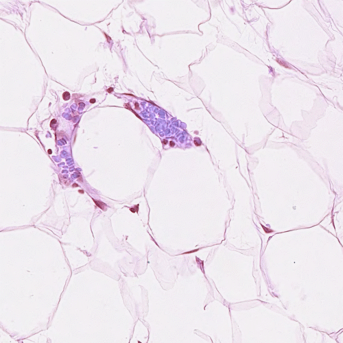

# 夏令营考核——基于相关滤波的物体追踪

## Task 1：

- [x] 实现最简单的帧差法运动物体追踪

帧差法：当视频中存在移动物体时，相邻帧之间在灰度上会有所差别，求取两帧图像的灰度差的绝对值，则静止的物体的像素在这个差值结果中的灰度值为0，而移动物体特别是该物体的轮廓处由于存在灰度变化为非0，这样就能大致计算出移动物体的位置，轮廓以及移动路径。

实现代码：[frame_difference](https://github.com/zeroRains/Task-for-object-tracking/blob/master/Task_1/frame_difference_method.py#L1)

实现效果：[result.avi](https://github.com/zeroRains/Task-for-object-tracking/raw/master/Task_1/result.avi)

实现过程：根据参考资料2，学习了帧差法的基础概念，因为他加了很多的图像处理方式，比如高斯平滑，腐蚀，膨胀等，我想试试如果单独只用差分法的结果会怎样，下面将展示部分单独使用差分法，使用高斯滤波，使用腐蚀肿胀，控制轮廓边长输出等等情况。我在实现代码中将帧差法封装成类，设置了四个可以变动的参数。

参数说明：
1. num: 表示帧差法到底差几帧，默认6
2. thread: 表示侦差后的图像，大于等于这个阈值的像素被保留，否则舍弃，默认10
3. fps：输出视频的帧率是多少，默认40
4. contours_len：轮廓的长度超过这个值才会画上检测框，默认500

实现效果截图：
1. 单独使用差分法（不加任何图像处理方式）:

    

    > 图像中小框很多，所以这就用上了我们类中的第四个参数，用来去除很多小框

2. 轮廓边长控制

    

    > 经过控制轮廓边长后，很多小框都消失了

3. 高斯平滑+轮廓边长控制

    
    
    > 好像差别不大

4. 高斯平滑+轮廓边长控制+膨胀+腐蚀

    
    
    > 好像好多了

（ps：还有很多调了超参的图就不展示了）

参考资料：
1. [OpenCV 图像处理之膨胀与腐蚀](https://zhuanlan.zhihu.com/p/110330329)
2. [高斯混合模型与差帧法提取前景](https://blog.csdn.net/qq_45087786/article/details/121865855)

## Task 2:

- [x] 手动复现论文[《Visual Object Tracking using Adaptive Correlation Filters. David S. Bolme, J. Ross Beveridge, Bruce A. Draper, Yui Man Lui. CVPR，2010》](https://ieeexplore.ieee.org/abstract/document/5539960)

论文学习记录：[「论文阅读」Visual Object Tracking using Adaptive Correlation Filters](https://blog.zerorains.top/2022/07/02/%E3%80%8C%E8%AE%BA%E6%96%87%E9%98%85%E8%AF%BB%E3%80%8DVisual-Object-Tracking-using-Adaptive-Correlation-Filters/)

实现代码：[mosse](https://github.com/zeroRains/Task-for-object-tracking/blob/master/Task_2/mosse.py#L1)

实现效果：[result.avi](https://github.com/zeroRains/Task-for-object-tracking/raw/master/Task_2/result.avi)

复现细节：

1. 首先是阅读了论文，理解文章的主要方法后，参考了参考资料3的代码进行复现。

2. 这个仓库的代码对追踪的效果从视觉上表现不错（指在跟踪点上，因为框的大小是固定的所以在追踪过程中框的位置会凸显出分割效果不好，但是在最初确定的中心点上，的跟踪还是比较准确的），但是这个代码缺少了评价指标PSR（Peak to Sidelobe Ratio）的计算过程，然后根据论文中的计算公式对PSR进行计算（对引用的第一段），在我的demo.mp4视频中，的平均PSR为9.73，前期的的PSR为2左右，但是到后面就稳定在11到12上（这个视频前面有一段是不动的，这个时候PSR会直线上升，当画面开始移动时PSR就稳定在11到12之间）。而在demo2.avi视频中（参考资料3中使用的视频），平均PSR为5.98，整个视频的PSR变化范围为3到7。在视频demo3.mp4中（针对眼珠进行追踪），他的平均PSR为4.67，整个视频的psr变化稳定在4到5之间。

   这样就显得比较奇怪了，因为在引用的第二段中，作者说这个一般追踪情况下PSR的值应该在20到60之间，并且认为低于7的时候是物体被遮挡或者追踪失败了。对于那些Naive的实现方式，PSR通常在3.0到10之间。按照我的实验结果来看，MOSSE的psr并没有达到20到60之间，而是和作者说的Naive方法一样，在7到10之间，这个有点奇怪。

   >As mentioned before a simple measurement of peak strength is called the Peak to Sidelobe Ratio (PSR). To compute the PSR the correlation output g is split into the peak which is the maximum value and the sidelobe which is the rest of the pixels excluding an 11 × 11 window around the peak. The PSR is then defined as $\frac {g_{max}-\mu_{sl}}{\sigma_{sl}}$ where $g_{max}$ is the peak values and $\mu_{sl}$ and $\sigma_{sl}$ are the mean and standard deviation of the sidelobe.
   >
   >In our experience, PSR for UMACE, ASEF, and MOSSE under normal tracking conditions typically ranges between 20.0 and 60.0 which indicates very strong peaks. We have found that when PSR drops to around 7.0 it is an indication that the object is occluded or tracking has failed. For the Naive implementation PSR ranges between 3.0 and 10.0 and is not useful for predicting track quality.

3. 上面那个问题解决了，查了相关资料（参考资料4），最后发现相关性其实是傅里叶域中信号处理的一个概念，所以在计算PSR的时候应该是在傅里叶域进行计算的。之前得到的数值非常低，是因为我计算PSR的位置是在进行反傅里叶变化回到空间域后才进行PSR的计算，所以这个结果就比较低。经过修正后的复现结果如下(不用预训练)：

   | 视频名称  | 平均PSR | PSR变换范围 |
   | --------- | ------- | ----------- |
   | demo.mp4  | 46.88   | 30.83—70.46 |
   | demo2.avi | 42.92   | 2.45—139.01 |
   | demo3.mp4 | 44.02   | 16.15—63.64 |

   (预训练128次)：
   
   | 视频名称  | 平均PSR | PSR变换范围  |
   | --------- | ------- | ------------ |
   | demo.mp4  | 69.08   | 31.91—210.56 |
   | demo2.avi | 42.95   | 11.84—152.04 |
   | demo3.mp4 | 44.04   | 17.07—66.65  |

4. 在参考代码中还发现了参考代码（参考资料4的链接）中可能存在的一个错误，他的代码中预训练部分，在Ai和Bi的部分没有使用学习率对滤波器进行更新，我感觉这样做可能和论文的结果不太吻合，于是我在这部分进行修改，将学习率引入到预训练更新滤波器的部分，结果发现，在demo2.avi和demo3.mp4中，PSR的值变高了，证明引入学习率到预训练中才是正确的写法。更新后的实验结果如下：

   (预训练128次)：

   | 视频名称  | 平均PSR | PSR变换范围  |
   | --------- | ------- | ------------ |
   | demo.mp4  | 48.81   | 32.06—97.14  |
   | demo2.avi | 52.31   | 18.99—224.74 |
   | demo3.mp4 | 57.10   | 42.30—81.35  |

   

参考资料：

1. [余弦窗(汉宁窗)的作用——图像预处理](https://blog.csdn.net/dengheCSDN/article/details/78085468)
2. [图像的仿射变换：cv2.warpAffine()](https://zhuanlan.zhihu.com/p/416073892)
3. [TianhongDai/mosse-object-tracking](https://github.com/TianhongDai/mosse-object-tracking)
3. [相关滤波器（Correlation Filters）](https://blog.csdn.net/sgfmby1994/article/details/68490903)

## Task 3:

- [x] 将相关滤波检测算法扩展应用到相似形状物体检测领域。(诸如细胞核检测、汽车检测等场景)

**初步想法**：相关滤波依赖于第一次给定的检测窗，这个检测窗会生成一个高斯峰，这个高斯峰的中心就是目标的中心，利用这一特点可以生成论文中的A和B（可以通过预训练的方式生成，也可以直接生成），然后通过这两个东西生成H，**先通过其计算出目标物体的相关性，然后使用滑动窗的方法，遍历图像的像素，依赖这个这个滤波器，计算出在这个滑动窗位置的相关性，依据这个相关性和目标进行比对，如果差距不超过一定的阈值，就说明他们是相似物体。**

(ps：突然想起来好像写上时间比较好)

**2022.7.8**

非常遗憾，初步想法好像并没有我想的那么简单，单凭一个检测框去获得相似图像的结果还是太单纯了。

这两天我学习了两篇文章：1. [Object detection and tracking benchmark in industry based on improved correlation filter ](https://link.springer.com/article/10.1007/s11042-018-6079-1) 2. [Simple real-time human detection using a single correlation filter](https://ieeexplore.ieee.org/abstract/document/5399555)。

在第一篇文章中，讲述了他们提出的一种基于dijkstra的相关滤波，用来实现目标检测和目标跟踪，他滤波器训练方法与传统直接将所有的图像进行训练不同，他对图片进行分批，分别生成不同的滤波器，然后使用通过构建的一个重构空间，将这些滤波器有效整合，最后生成最终具有鲁棒性的滤波器。但是文章好像默认咱会相关滤波器实现目标检测的方法，因此没有详细描述相关滤波实现目标检测的具体细节（提供了matlab的代码）。然后在他的参考文献中，我找到的第二篇文章，在这篇文章详细介绍了ASEF相关滤波器实现目标检测的一般方法：首先是需要给出一定数量的图片，然后给出图像中人的位置，对这些位置进行截取，并通过他们生成相关滤波，并进行反复迭代，最后对每一个滤波器的值取一个平均，就可以生成最终的滤波器。然后使用这个滤波器采用卷积的方式对图像进行滑动窗式的卷积运算，在有人的位置会产生比较大的峰值，当这个峰值超过某个阈值，就可以认为是一个人，以这个峰值为中心绘制一个和滤波器大小一致的框，即可完成人的检测。

这个具体的方法和我最初的想法差距不大，就是在训练的部分不太一致。这又涉及到一个问题，这样的方法应该怎么实现，我认为手动实现的滑动窗卷积算法时间复杂度太高了，计算一张正常图像太久了（后面想看看opencv上有没有什么现成的API实现卷积（已解决）），接着就是完成数据集构造，最后按照论文的相关思路实现代码复现（可以参考一下文章1中的matlab源码）。

matlab上的源码（dijkstra的那个论文）只有跟踪的，我按着第2篇的思想写了一下代码，感觉思路没太有问题，但是结果就是算不出来满意的结果（得到了白色部分比黑色部分多的结果，并且不是点式的相关图）。

现在我碰到的问题就是不知道怎么制作和处理这个数据集，首先需要训练一个滤波器，这个滤波器的大小应该是多少，然后这个数据集的标签应该怎么做。我现在的做法是：

1. 数据集制作上，我会将图像中的目标裁剪下来，然后作为一个训练图像进行保存
2. 然后利用这个裁剪下来的结果生成一个高斯映射图，在使用这张图的灰度图像与高斯映射图使用MOSSE的方法去生成Ai和Bi
3. 训练128次，然后用Ai除以Bi得到H的共轭
4. 在推理过程中就是将，图像缩放到和滤波器一样的大小（感觉是这部分出了问题，首先是滤波器的大小肯定是比原图小的，这样如果要转化到傅里叶域进行element-wise的乘法，则需要图像和滤波器的大小一致，但是缩放的图像导致很多内容损失了，感觉不合理。但如果说把滤波器转化到空间域，然后再和图像做卷积运算，这样也得不到令人满意的结果），然后将图像转化成频域，在频域与H的共轭相乘得到响应图，将响应图转化到空间域，取出实部之后，使用normalization，然后乘上255显示出相关图，这时候理论上应该目标的中心点会是高亮部分，但结果是白色部分比黑色还多，并且不是呈点状的。这很奇怪，这个方法行不通

下一步：根据论文2中，引用的[Average of Synthetic Exact Filters ](https://ieeexplore.ieee.org/document/5206701)，他在论文中详细的训练过程有在这里说明，所以 下一步的话还是会继续看论文（复现跟踪的代码挺多的，检测的代码就是找不到，太奇怪了）。

**2022.7.9**

看完了参考资料4中的论文，我感觉和我理解的也没有差别太大，主要是数据集的制作上不太一样，以下是差距：

1. 数据集的输入肯定是图像，然后生成一个相关图，这个相关图是怎没做呢。和MOSSE生成高斯图是一样的，但是和我设想的方法不一样的是，他在参考资料4的论文中一张图像只对应一个高斯峰值，也就是说一张图像只检测一个物体（虽然他说可以通过设置多个峰值实现，多个物体检测，但是多个高斯分布图的结合还有待学习，现在想法是先完成一张图只检测一个相似物体）
2. 然后现在有一个问题，如果是一张图像和一个相关图进行训练，那么滤波器的尺寸就要和图像和相关图大小相等，这样的话滤波器是不是太大了，参数太多的话训练起来好像也不太好。有一个解决方案是，resize这个图像，使滤波器变小，然后在获得输出结果之后再根据缩放比例将峰值映射回原图，并绘制一个检测框。那么问题又来了，这个滤波器的大小设置为多大合适呢？要不设置成超参数？

**顺利完成！！！！**

这次是使用了一个新的数据集，由于我没有找到细胞核检测合适的数据集，所以找了个细胞检测分割的数据集，我通过手动标注他的高斯分布响应图，加上水平垂直翻转的数据增强方法，构造了这个数据集

实现的代码为：[detect_single_target.py](https://github.com/zeroRains/Task-for-object-tracking/blob/master/Task_3/detect_single_target.py#L1)

现在的算法是：

1. 读取图像和GT，将他们堆叠成一个NxHxW的向量
2. 使用预处理处理图像，解决边界效应
3. 根据MOSSE的公式生成相关滤波H的共轭需要的Ai和Bi并进行预训练
4. 将训练好的Ai和Bi计算出滤波器H的共轭存储到类的属性中，并将滤波器参数保存成文件
5. 在推理中，先读取图片，预处理图像
6. 使用之前生成好的滤波器H的共轭与转化到傅里叶域的预处理图像进行element-wise乘法
7. 将计算结果转回空间域
8. 寻找出峰值所在的坐标
9. 将坐标映射回原图像，这个坐标就是要寻找目标的中心
10. 以这个坐标为中心，向外绘制一定半径的园，就能把我们的目标标记出来

这个方法可以实现相似形状的物体检测，但是仍然有一定的局限性

1. 目前我只做了一张图像一个相似物体的检测，后面会尝试一下，一张图像多个物体的检测
2. 由于滤波器生成的结果只能定位到目标物体的中心，所以边界框的大小只能是定死的，感觉没有比较有效的方法去改变边界框的尺寸，这与使用MOSSE进行跟踪是一致的，MOSSE在跟踪上只能对检测框的中心进行移动，而不能改变检测框本身的尺寸。

现在的检测结果如下图所示：

**2022.7.10**

按照参考文献5中的说法，对于多目标检测的话他应该是只需要在标记上多标记几个峰值就可以了，其他的处理过程都是一致的。我从driveSeg数据中筛选出40张车辆的图像，然后对车辆的中心位置进行标记，实现了一张拥有多个高斯峰值的GT。在训练完成后，他仍然是只存在一个峰值，并且，这个峰值总是在中心位置附近，我现在有点怀疑，单物体检测（细胞检测）的成功是否是因为他的目标正好在图像的中心，但是我仔细核对代码和论文的对应，基本上每一步都是对得上的，这就很奇怪了。

后面我在查找资料的过程中，发现了参考资料7：[Correlation Filters for Detection of Cellular Nuclei in Histopathology Images](https://link.springer.com/article/10.1007/s10916-017-0863-8)，在学习这篇论文的过程中，我发现我的操作与其描述的内容一致，唯一不同之处就在于我们使用的数据集与其不同，似乎他用的数据集是之前就被标记好的。这篇文章的代码是开源的，我后面打算仔细研究一下他的代码，在查看一下他使用的数据集和我自制的数据集有何不同（会不会是我自制的数据集图像太少了，使得训练结果并不好，找了4-5天了总算找到个可以参考的代码了）。

怪了，我自己写的代码，和参考资料7中提供的代码本质上都一样呀，为什么会得不到好的结果呢？难道真的是数据集少了？那我用他的数据集试试。

**新发现**：

我在学习了他的源码之后，发现他使用的滤波器和图像是相同大小的，但是我把我的滤波器缩放到固定大小了，后面我尝试使用和原图大小一样的滤波器，结果他在相关图上（就是H和F计算出的G在空间域上的gi）峰值点的位置上，对应原图中的目标，并且峰值点不止一个。然后又产生一个问题，这些峰值点的数值不统一，即不全是gi的max，用阈值来控制他和gi.max的差距时，gi.max周围的几个像素，与gi的差距又会比较明显。所以得想办法区分出他们的这些峰值。

实现代码：[detect_multi_targets.py ](https://github.com/zeroRains/Task-for-object-tracking/blob/master/Task_3/detect_multi_targets.py#L1)

还要一个情况就是我的数据集只有40张图像，实在太少了，导致效果只对训练的图像表现较好。部分结果如下图

所以后面还是尝试一下参考资料7中提到的数据集。

**2022.7.11**

今天尝试了使用资料7中的数据集，采用之前汽车检测的方法对结果进行训练，实验结果比较惨，基本上该有的东西都没有，所以后面打算参考一下资料7的代码，分析之前在哪个地方有问题（感觉是在标签制作上有点问题）

（今天浙大软院机试后面没干啥了_(:з」∠)_）

**2022.7.12**

按照参考资料7中的代码，对我自己编写的代码进行修改，然后获得了如下的结果。

第一张明显的细胞图像是原图，第二张灰度的结果是相关图可视化后的结果（即使用相关滤波器处理的结果），第三张二值图像就是Ground Truth。从结果上看，相关图中的极大值点大部分对应了GT中的细胞核位置，说明预测是有一定效果的，但是现在面临一个问题，虽然他们都是极值点，但是他们的实际的数值不是全都一样的，这就导致的了即使检测出了细胞核仍然难以通过相关图获取到对应细胞的坐标（因为我现在还没有查到获取图像中这些突出的极值点坐标的方法）。所以，对方提供的代码仍然是有一些不足的。

实现代码：[detect_multi_targets_cell.py](https://github.com/zeroRains/Task-for-object-tracking/blob/master/Task_3/detect_multi_targets_cell.py)

参考资料：

1. [Object detection and tracking benchmark in industry based on improved correlation filter ](https://link.springer.com/article/10.1007/s11042-018-6079-1)
2.  [Simple real-time human detection using a single correlation filter](https://ieeexplore.ieee.org/abstract/document/5399555)
3. [OpenCV 图像卷积：cv.filter2D() 函数详解](https://blog.csdn.net/hysterisis/article/details/113097507)
4. [Average of Synthetic Exact Filters](https://ieeexplore.ieee.org/document/5206701)
5. [ASEF（阅读笔记）](https://blog.csdn.net/kaka_36/article/details/18353155)
6. [zxaoyou/segmentation_WBC: White blood cell (WBC) image datasets ](https://github.com/zxaoyou/segmentation_WBC)
6. [Correlation Filters for Detection of Cellular Nuclei in Histopathology Images](https://link.springer.com/article/10.1007/s10916-017-0863-8)
6. [foxtrotmike/CoreHist: Correlation Filters for Detection of Cellular Nuclei in Histopathology Images ](https://github.com/foxtrotmike/CoreHist)
