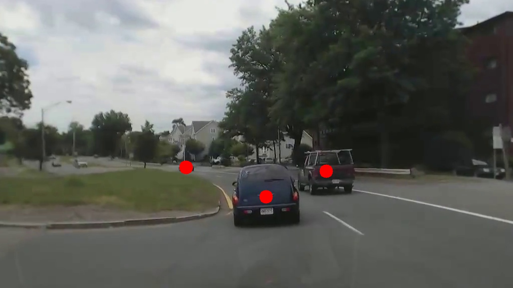
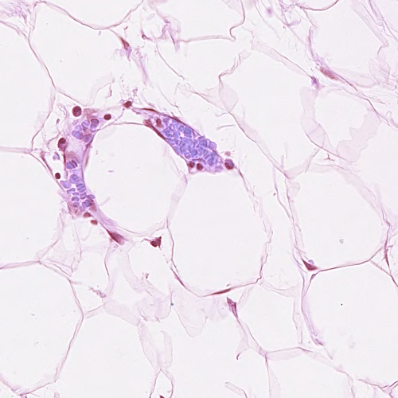
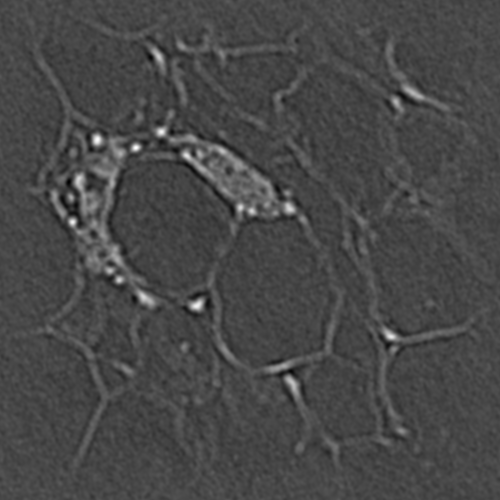

# 基于相关滤波的物体追踪——代码说明文档

复现人：卢林军

github仓库地址：[zeroRains/Task-for-object-tracking](https://github.com/zeroRains/Task-for-object-tracking)

>研究过程见 研究日志.pdf

## 运行环境：

python 3.7.8

|    工具包     |   版本   |
| :-----------: | :------: |
|     numpy     |  1.21.6  |
|     scipy     |  1.2.1   |
| opencv-python | 4.3.0.36 |
|     tqdm      |  4.48.2  |
|    pandas     |  1.0.5   |
|  matplotlib   |  3.3.0   |
| scikit-image  |  0.17.2  |

## Task1：实现最简单的帧差法运动物体追踪

帧差法：当视频中存在移动物体时，相邻帧之间在灰度上会有所差别，求取两帧图像的灰度差的绝对值，则静止的物体的像素在这个差值结果中的灰度值为0，而移动物体特别是该物体的轮廓处由于存在灰度变化为非0，这样就能大致计算出移动物体的位置，轮廓以及移动路径。

实现代码文件夹：`./Task_1`

实现效果：`./Task_1/result.avi`

运行方式：

>cd Task_1
>
>python frame_difference_method.py

代码参数说明：

核心代码是`frame_difference_method.py`

在运行代码的main函数中可以通过修改path的文件路径修改要用于帧差法的视频文件。

代码中设计了`FrameDifference`类，初始化参数如下表：

| 参数名称        | 默认值（无表示必填） | 描述                                                         |
| --------------- | -------------------- | ------------------------------------------------------------ |
| path            | 无                   | 要运行帧差法的视频路径                                       |
| num             | 6                    | 帧差法中具体差多少帧                                         |
| thread          | 10                   | 帧差法两帧之间差距的阈值，小于阈值的像素将被舍弃，大于等于阈值的像素则被保留 |
| fps             | 40                   | 输出的视频保存的帧率（最好不要超过视频的原始帧率）           |
| contours_len    | 500                  | 轮廓长度超过这个值才会保留这个轮廓                           |
| show_in_windows | False                | 是否使用opencv的展示窗展示过程                               |

`FrameDifference`类，只有一个`run`方法，用于运行帧差法，需要输入**经过帧差法处理后的视频保存路径**作为这个方法的参数。

## Task2：手动复现论文[《Visual Object Tracking using Adaptive Correlation Filters. David S. Bolme, J. Ross Beveridge, Bruce A. Draper, Yui Man Lui. CVPR，2010》](https://ieeexplore.ieee.org/abstract/document/5539960)

本文提出一个滤波器MOSSE用于实现目标追踪，在初始帧中，按照论文中的公式5生成滤波器在傅里叶域的共轭，在后续帧中，使用滤波器处理经过傅里叶变换处理的后续帧图像，并得到响应图（相应图的峰值点就是目标的中心位置），通过寻找响应图的峰值，计算出目标的偏移量，然后根据原来的坐标参照偏移量对坐标进行修改，通过使用论文中公式10，11，12在线更新滤波器的参数，并继续运用于下一帧。

实现代码文件夹：`./Task_2`

实现效果：

1. `./Task_2/result1.avi`
2. `./Task_2/result2.avi`
3. `./Task_2/result3.avi`

运行方式：

>cd Task_2
>
>python mosse.py

运行后会弹出一个窗口，需要手动标记要跟踪的目标，之后就能自动跟踪了。

代码参数说明：

核心代码是：`mosse.py`

在运行代码的`main`函数中可以修改`run`方法中的两个参数，第一个是要进行跟踪的视频，第二个是跟踪结果视频的存储路径。除了运行跟踪算法外，还计算了每一帧的PSR（peak-to-sidelobe rate，论文中提到的指标），并展示，在运行算法结束后会打印平均的PSR和最大，最小PSR。

代码中主要设计了`MOSSE`类，其初始化参数如下表：

| 参数名称        | 默认值（无表示必填） | 描述                                               |
| --------------- | -------------------- | -------------------------------------------------- |
| sigma           | 100.0                | 生成高斯峰的方差                                   |
| lr              | 0.125                | 论文中在线更新公式提到的学习率                     |
| fps             | 40                   | 输出的视频保存的帧率（最好不要超过视频的原始帧率） |
| show_in_windows | False                | 是否使用opencv的展示窗展示过程                     |
| pretrain_num    | 0                    | 预训练轮数                                         |

## Task3：将相关滤波检测算法扩展应用到相似形状物体检测领域。(诸如细胞核检测、汽车检测等场景)

使用相关滤波器进行目标检测的核心就是，生成一个相关滤波器，他与目标图像在傅里叶域进行element-wise的乘法，再转换回空间域后输出的图像中，峰值点的位置，正好是目标的位置。在这里要注意一点，由于滤波器是在傅里叶域对整张图像进行处理，因此这个滤波器应该和图像相同大小，在设计时需要考虑是否需要对图像进行缩小再生成滤波器。

### 单目标检测

但目标检测主要实现的是单细胞核检测，一张图像中只有一个细胞，目的是找到细胞的中心，然后将这个细胞圈出来。结果如下：


实现代码文件夹：`./Task_3`

核心代码：`select_train_data.py`、`detect_single_target.py`

运行方式

```python
# 生成数据集索引文件（数据集已存放在source文件夹中，直接运行即可）
python select_train_data.py
# 单目标检测训练，参数保存，加载滤波器参数，推理
python detect_single_target.py
```

代码参数说明：

在`select_train_data.py`中，`get_file_txt`函数用于生成图像索引文件(单细胞检测)，输入的参数为数据集路径和输出文件的保存路径。`generate_gauss_label`函数用于给细胞图像制作数据集(已经做好了无须重复操作)，输入的参数为图像索引文件的存储路径。

在`detect_single_target.py`中，设计了以`Detector`类，其初始化参数为：

| 参数名称        | 默认值（无表示必填） | 描述                           |
| --------------- | -------------------- | ------------------------------ |
| pretrain_num    | 0                    | 预训练轮数                     |
| h               | 100                  | 相关滤波器的高                 |
| w               | 100                  | 相关滤波器的宽                 |
| show_in_windows | False                | 是否使用opencv的展示窗展示过程 |

这个类有四个方法

1. `train()`，需要传入的参数是图像索引文件，用于训练滤波器
2. `save()`，需要传入参数为滤波器参数保存文件的路径，用于保存滤波器参数
3. `load()`，需要传入参数为滤波器参数保存文件的路径，用于加载滤波器参数
4. `run()`，需要传入参数为要检测的图像路径，用于执行单目标检测

### 多目标检测

多目标检测的思路和单目标检测的思路基本相同，只是在制作标签时，不再是只制作一个高斯峰（目标中心），而是通过标记多个物体，在每个物体中心都生成一个高斯峰。要注意的是，在多目标检测中，滤波器的大小不能太小，否则会影响多目标检测的效果

#### 汽车检测

实现代码文件夹：`./Task_3`

核心代码：`select_train_data.py`、`detect_multi_targets.py`

实现效果：

1. 检测结果：

   

2. 相关图：

   


运行方式：

```python
# 生成数据集索引文件（数据集已存放在source文件夹中，直接运行即可）
python select_train_data.py
# 多目标检测训练，参数保存，加载滤波器参数，推理
python detect_multi_targets.py
```

代码参数说明：与单目标检测基本一致

#### 细胞核检测

实现代码文件夹：`./Task_3`

核心代码：`generate_data_file_cell.py`、`detect_multi_targets_cell.py`

实现效果：

1. 原图：

   

2. 相关图：

   

3. Ground Truth:

   

运行方式：

```python
# 生成数据集索引文件（数据集已存放在source文件夹中，直接运行即可）
python generate_data_file_cell.py
# 多目标检测训练，参数保存，加载滤波器参数，推理
python detect_multi_targets_cell.py
```

代码参数说明：

首先需要下载数据集[CRCHistoPhenotypes](https://warwick.ac.uk/fac/cross_fac/tia/data/crchistolabelednucleihe/crchistophenotypes_2016_04_28.zip)，并在`generate_data_file_cell.py`中，将path变量中的路径修改为数据集存放的路径(不带中文)。然后就可以直接运行了（生成多个高斯峰的时间可能会比较久，大概10分钟左右）。

在`detect_multi_targets_cell.py`中，也是有一个`Detector`类，其初始化参数与单目标检测参数一致。

